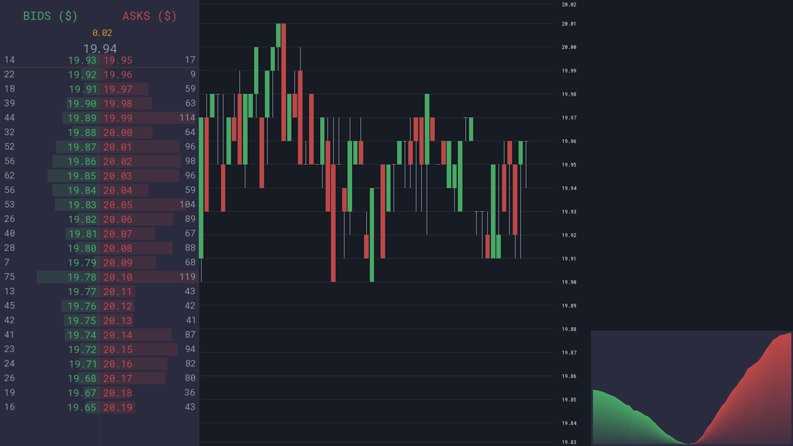

# Market Simulator

A real-time limit order book and exchange simulator written in modern C++, featuring a custom SFML-based rendering engine.

This project implements a price-time priority matching engine, real-time candlestick aggregation, cumulative depth visualization, and autonomous trading agents in an interactive graphical environment.

---

## Preview



---

## Features

- Price-time priority limit order book
- Matching engine with partial fills and cancellations
- Real-time candlestick aggregation
- Sticky Y-axis scaling with dynamic price grid
- Cumulative depth chart visualization
- Order book (bid/ask ladder) display
- Autonomous trading agents
- Custom UI rendering (SFML)

---

## Architecture

Core modules:

- LimitOrderBook – matching engine with price-time priority
- Trader – capital, inventory, and order lifecycle management
- CandleChart – tick-based aggregation and price visualization
- DepthChart – cumulative bid/ask volume visualization

---

## Tech Stack

- C++20
- SFML
- CMake

---

## Build

```bash
mkdir build
cd build
cmake ..
cmake --build .
```

Run the generated executable from the build directory.

## License

- MIT License

## Motivation

This project explores exchange mechanics, market microstructure, and real-time data visualization from a systems and performance perspective.