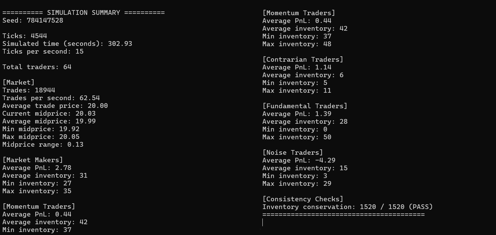

# Market Microstructure Simulator

A multi-agent limit order book simulator written in modern C++ for studying electronic market microstructure.

The project implements a price-time priority matching engine, heterogeneous trading agents, inventory accounting, and market diagnostics to study price formation and liquidity dynamics in a continuous double auction environment.

---

## Preview

### Simulation


### Simulation Summary


---

## Features

Market Engine:
- Price-time priority limit order book
- Matching engine with partial fills and cancellations
- Inventory and capital accounting
- Order lifecycle management

Trading agents:
- Market makers
- Momentum traders
- Contrarian traders
- Fundamental value traders
- Noise traders

Diagnostics:
- Trader PnL tracking
- Inventory distribution analysis
- Price range statistics
- Market stability checks

Visualization Components:
- Real-time candlestick chart
- Order book ladder display
- Cumulative depth chart
- Custom SFML UI

---

## Architecture

Core components:

LimitOrderBook  
Matching engine implementing price-time priority and trade execution.

Trader  
Tracks capital, inventory, PnL, and active orders.

Strategies  
Encapsulate agent decision logic and trading behavior.

Simulation Clock  
Discrete-time simulation driver.

Visualization  
Order book, depth, and price chart rendering.

---

## Engineering Decisions

- Deterministic RNG seeds enable reproducible simulations
- Order pool reuse minimizes allocation overhead
- Trader update ordering ensures consistent agent interaction
- Inventory conservation checks validate simulation correctness
- Modular strategy interface enables easy experimentation

---

## Trader Types

Market Maker  
Provides liquidity through two-sided quoting and inventory-aware pricing.

Momentum Trader  
Trades in direction of recent price movements.

Contrarian Trader  
Trades against short-term price deviations.

Fundamental Trader  
Trades relative to an internal fair-value estimate.

Noise Trader  
Provides stochastic background order flow.

---

## Tech Stack

- C++20
- SFML
- CMake

---

## Requirements

- C++20 compatible compiler
- CMake 3.20+
- Git (for SFML FetchContent)

## How to Run

Build:

```bash
mkdir build
cd build
cmake ..
cmake --build .
```

Run:

```bash
cd bin/Debug
MarketSim.exe
```

## License

- MIT License

## Motivation

This project explores electronic exchange mechanics, market microstructure, and agent-based price formation from a systems engineering perspective. The goal was to build a modular simulation environment capable of modeling heterogeneous trading behavior and emergent market dynamics.